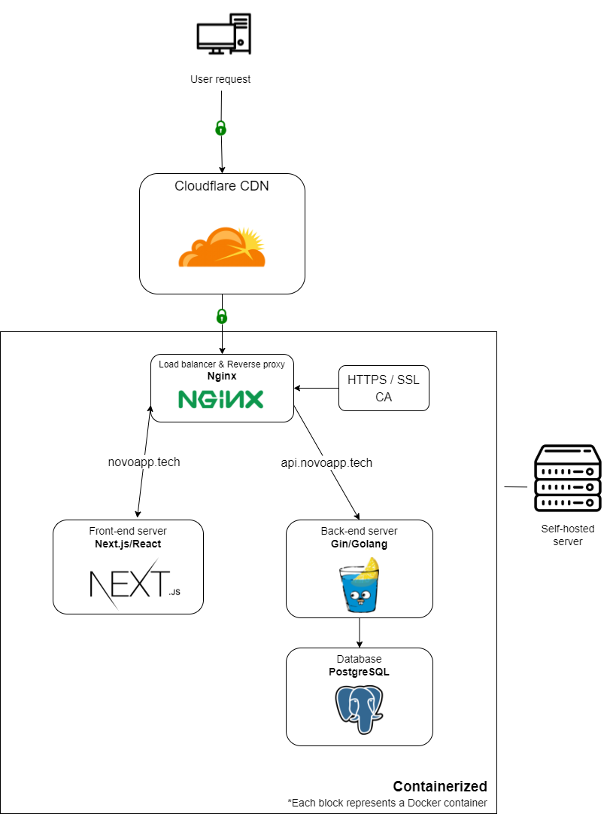

# novo-app
A high-performance book/comic server that provides:
- Book reading, uploading features
- An omnipotent full text search function
- Communication features
- A buttery-smooth UI
- Role-based access control for users

This system is currently unportable and will remain this way because some of the core features are coupled with external systems such as Google Cloud or Cloudflare.
## Server structure

## Usage
To build server images and start the server, run

`docker compose up`
